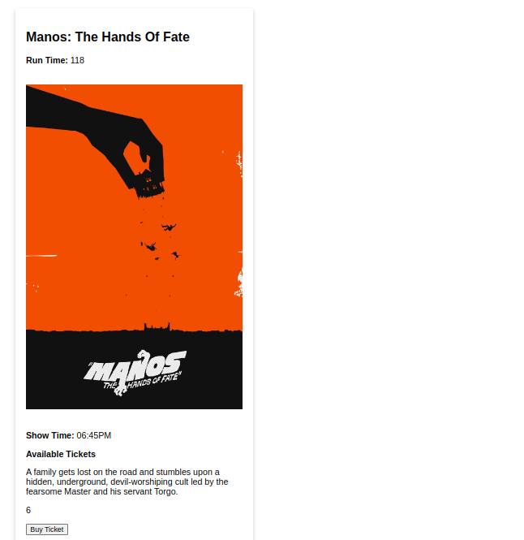

# wk3-code-challenge

# Description
-This code challenge requires one to create an application that will enable a user to purchase movie tickets

# Getting Started
-Ensure you have a computer that supports Linux,Windows and Mac OS.

-Very splendid if you have nodejs

# Built With
-HTML

-CSS

-JAVASCRIPT

# Installation
-Open a terminal / command line interface on your computer

-Clone the repo by using the following:

    git clone https://github.com/Skanner33/wk3-code-challenge.git
-Be patient as it creates a copy on your local machine for you.

-Change directory to the repo folder:

    cd wk3-code-challenge
-(Optional) Open it in Visual Studio Code

    code .
-(Alternate Option) Open it in any editor of your choice.

-Scroll down to read Running the application(DO NOT FORGET!!!)

# Running the application
-Running the application is very straight forward. You can use the following steps to run the app.

-First ensure you have installed the extension 'Live Server' in your Visual studio code.

-On the bottom right part of your Visual Code you should be able to see a text written "Go Live".

-Select the index.html file.Then click GO LIVE on the bottom right corner of your editor.

-It will automatically direct you to the browser where the code challenge is at.

-Click on the challenge and voila you can vote for the cutest animal.

# What Does What?
-Once you navigate into the site on the left side of your screen you'll be able to see the various movies that are to be viewed.

-Choose what movie you'd like to see and click on it.

-You'll be directed to a page that looks like this;

-Once there scroll to the bottom of the page and buy your ticket (psst! They are quite limited) and voila enjoy your movie.

# Authors
This project was contributed to by:

- Mathew Mageto

# License
The project is licensed under Apache 2.0.